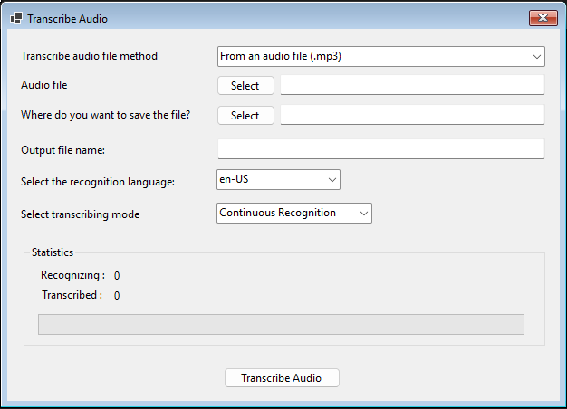

## 👋 Introduction

A WPF C# application that transcribes .mp3 audio files into text using Microsoft Azure Speech Recognition Services. It supports real-time transcription progress, and allows users to save and export transcriptions in text files.



## 🌟 Features

- **Transcribe .mp3** : Users can transform any .mp3 file into a text document
- **Folder Destination** :Users can save the converted text document to their preferred folder.
- **Rename Output file** : Users can rename the text output file to their prefferred name.
- **Support different recognition language** : Users can transcribe audio files in a variety of languages.
- **Real-time transcription progress** : The app displays real-time transcription progress, including recognized words and transcribed lines.

## 👨‍💻 Technologies

- **C#** : WPF written in C# for UI development.
- **Microsoft Azure Speech Recognition services** : Cloud Azure Cognitive Services, providing advanced speech-to-text capabilities

## ⚙️ Pre-start settings

1. Sign Up on Azure subscription - [Create one for free](https://azure.microsoft.com/en-us/pricing/purchase-options/azure-account?icid=ai-services).

2. [Create a Speech resource](https://portal.azure.com/#create/Microsoft.CognitiveServicesSpeechServices) in the Azure portal.

3. Select your Speech resource key and region. After your Speech resource is deployed, select Go to resource to view and manage keys. For more information about Azure AI services resources, see [Get the keys for your resource](https://learn.microsoft.com/en-us/azure/ai-services/multi-service-resource?pivots=azportal#get-the-keys-for-your-resource).

## 🔧 Set up Windows environment variables

4. To set the environment variables for your Speech resource key, open a Windows console and enter the following commands to create your system environment variables:

   - **setx SPEECH_KEY** `your KEY 1`
   - **setx SPEECH_REGION** `your Location/Region`

## 🎗️ Instalation Steps

5. Clone the repo:

```
git clone https://github.com/pfiterman/wpfAppTranscribeAudio.git
```

6. Open the solution **TranscribeAudioWpfApp.sln** on Visual Studio and Run the Application. Enjoy!

## 🤝 Support me to create more cool stuff

[](https://buymeacoffee.com/pfiterman)
